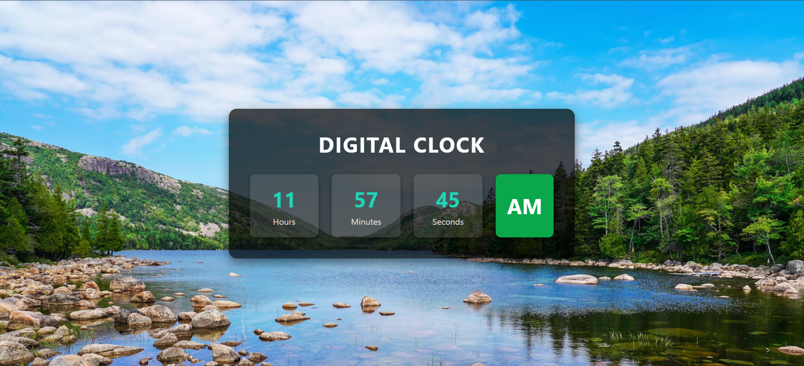

## Digital-Clock

A simple and responsive **Digital Clock** built using **HTML**, **CSS**, and **JavaScript**. This clock displays the current time in a 12-hour format with AM/PM and updates every second in real-time.

## 📸 Preview

 

## 🚀 Features

- Real-time clock updates every second
- 12-hour format with AM/PM
- Responsive design for different screen sizes
- Clean and minimal UI

## 🛠️ Built With

- HTML5
- CSS3
- JavaScript.
